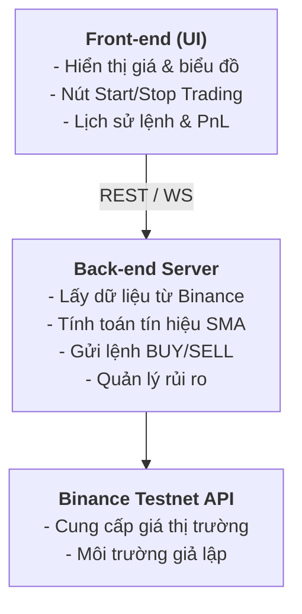

# **Đề tài: Xây dựng Bot Giao dịch Tiền điện tử trên Binance Testnet**

## **1. Mục tiêu của Đề tài**

*   **Tìm hiểu công nghệ Blockchain** và ứng dụng của nó trong giao dịch tiền điện tử.
*   **Tìm hiểu và sử dụng Binance API (Testnet)** để lấy dữ liệu thị trường và thực hiện lệnh giao dịch tự động.
*   **Xây dựng ứng dụng Web** hoàn chỉnh bao gồm:
    *   **Front-end:** Giao diện điều khiển bot trading, trực quan hóa dữ liệu.
    *   **Back-end:** Kết nối với Binance Testnet, xử lý thuật toán trading và quản lý rủi ro.
*   **Thiết kế thuật toán trading** tự động đơn giản (ví dụ: SMA Crossover Strategy).
*   **Triển khai và demo** hệ thống thực tế, kiểm thử trên môi trường Binance Testnet.

## **2. Phạm vi và Công nghệ sử dụng**

| Thành phần | Công nghệ | Mục đích |
| :--- | :--- | :--- |
| **Blockchain** | Binance Smart Chain (tham khảo) | Hiểu cơ chế lưu trữ & xác thực giao dịch |
| **API Trading** | Binance Spot Testnet API | Lấy dữ liệu & đặt lệnh mua/bán |
| **Back-end** | Node.js + Express + TypeScript | Giao tiếp với Binance API, xử lý logic |
| **Front-end** | React (Vite) / HTML / Chart.js | Hiển thị giá và điều khiển bot |
| **Giao tiếp** | REST API / WebSocket | Kết nối realtime giữa server và client |
| **Quản lý code** | GitHub Projects + Issues | Theo dõi tiến độ nhóm |
| **Triển khai (tùy chọn)** | Railway / Render / Docker | Deploy ứng dụng demo |

## **3. Kiến trúc hệ thống**

## **4. Thuật toán Trading (Ví dụ: SMA Crossover)**

#### **Ý tưởng:**

Dựa trên việc tính toán và so sánh hai đường trung bình động đơn giản (SMA) với các khung thời gian khác nhau:
*   **SMA nhanh (fast):** Ví dụ, trung bình giá của 7 cây nến gần nhất.
*   **SMA chậm (slow):** Ví dụ, trung bình giá của 25 cây nến gần nhất.

#### **Quy tắc giao dịch:**
*   **Tín hiệu MUA (BUY):** Khi đường SMA nhanh cắt lên trên đường SMA chậm.
*   **Tín hiệu BÁN (SELL):** Khi đường SMA nhanh cắt xuống dưới đường SMA chậm.

#### **Quản lý rủi ro:**
*   **Giới hạn lỗ hàng ngày:** Ngừng giao dịch nếu tổng lỗ trong ngày vượt quá một ngưỡng nhất định (`MAX_DAILY_LOSS`).
*   **Giới hạn khối lượng giao dịch:** Kiểm soát khối lượng tối đa cho mỗi lệnh (`MAX_OPEN_NOTIONAL`).

## **5. Kết quả mong đợi**

✅ **Ứng dụng web** có khả năng lấy và hiển thị giá realtime từ Binance Testnet.

✅ **Thực hiện lệnh BUY/SELL** tự động dựa trên tín hiệu từ thuật toán SMA Crossover.

✅ **Ghi log giao dịch**, hiển thị biểu đồ trực quan và trạng thái hoạt động của bot.

✅ **Hoàn thiện tài liệu** hướng dẫn sử dụng, báo cáo học thuật và video demo sản phẩm.
